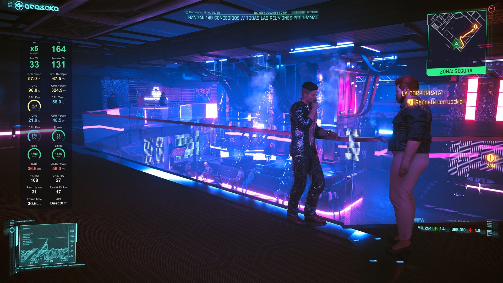
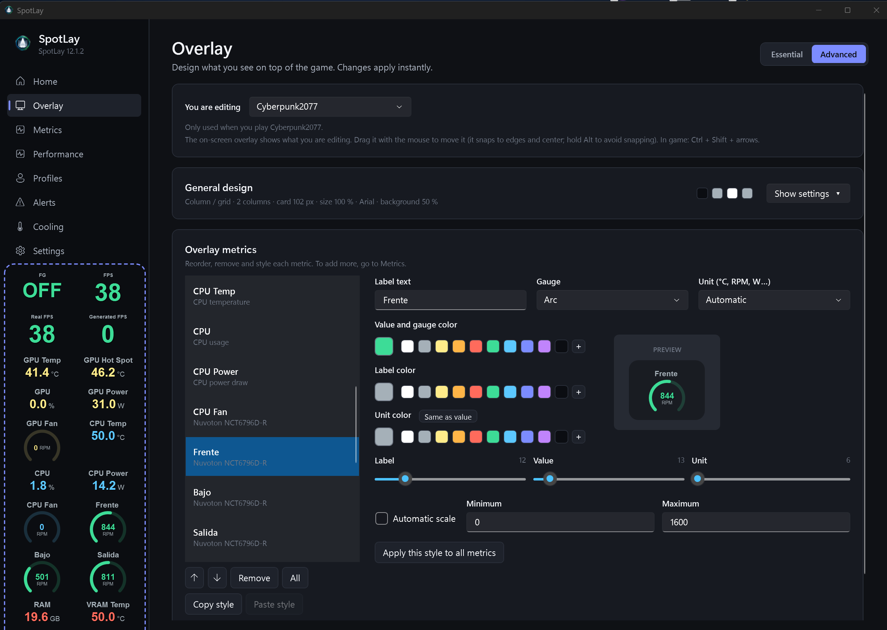
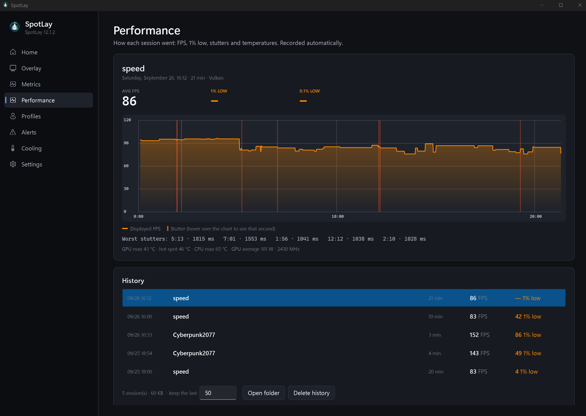
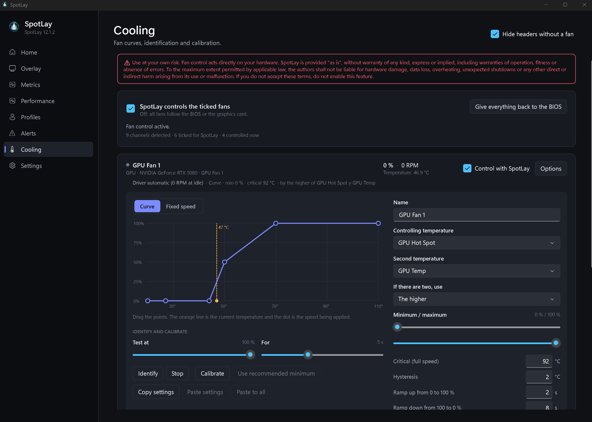
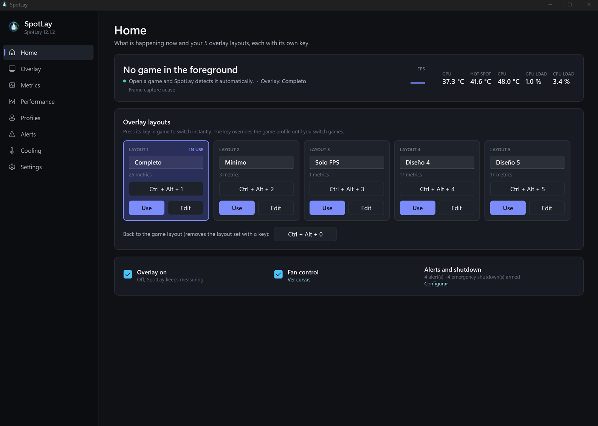

# SpotLay

[English](README.md) · **Español**

**Mira cuántos frames renderiza de verdad tu gráfica.** Con Frame Generation activado, el contador de FPS enseña el total, generados incluidos. SpotLay lo separa: **FPS reales, FPS generados y el multiplicador de Frame Generation** (x2, x3, x4… y si el Multi Frame Generation de NVIDIA es **fijo o dinámico**), medido en directo en el juego, no estimado.

```
FG  x4 DINÁMICO     FPS 140
FPS reales  35      FPS generados 105
```



SpotLay dibuja encima de tus juegos un overlay limpio con los FPS reales, los generados, el multiplicador de Frame Generation, el 1% / 0,1% low y cualquier sensor de tu PC (temperaturas, consumos, frecuencias, ventiladores…). Además graba cada partida, puede controlar tus ventiladores con curvas propias y avisarte (o apagar Windows de forma ordenada) si un sensor se calienta demasiado.


## Qué hace

- **Frame Generation medido, no supuesto.** FPS reales (renderizados), FPS generados, FPS totales y el multiplicador (x2, x3, x4…), también con el Multi Frame Generation dinámico de NVIDIA (se ve como `x4 DINÁMICO` / `FIJO`).
- **Estabilidad.** 1% y 0,1% low de los frames a pantalla y de los reales, y una gráfica de frametime en el juego.
- **Cualquier sensor.** Gráfica, CPU, memoria, placa base, discos, red y ventiladores. Si un sensor no existe en tu PC, SpotLay muestra `—`: nunca pone otro valor en su lugar.
- **Editor del overlay en directo.** Editas el overlay mientras lo ves en pantalla: lo arrastras con el ratón, con Ctrl + arrastrar cambias de sitio una tarjeta, y cambias colores, tamaños y gráficos (número, arco, anillo, barras, línea) viendo cada cambio al momento.
- **Diseños y perfiles.** 5 diseños globales con su tecla y un diseño propio para cada juego.
- **Historial de rendimiento.** Cada partida se graba sola: FPS en el tiempo, lows, tirones y temperaturas.
- **Control de ventiladores.** Curvas por ventilador, identificar y calibrar canales, temperatura crítica, y todo vuelve a la BIOS al cerrar SpotLay.
- **Avisos y apagado de emergencia.** Avisos por sensor encima del juego y, si lo activas, un apagado ordenado de Windows con cuenta atrás que puedes cancelar.
- **Español e inglés.** Se elige al abrirlo por primera vez y se cambia en Ajustes.
- **Actualizaciones automáticas** desde esta página.


## Capturas

**Editor del overlay en directo:** el overlay de la pantalla muestra cada cambio al momento.


**Historial de rendimiento:** cada partida se graba sola, con los tirones marcados.


**Control de ventiladores:** curvas, calibración y 0 RPM en reposo para los ventiladores de la gráfica.


**Inicio:** 5 diseños de overlay, cada uno con su tecla.


## Requisitos

- Windows 11 de 64 bits (probado). Windows 10 de 64 bits debería funcionar, pero aún no se ha probado.
- Permisos de administrador (SpotLay lee los eventos de frames y los sensores; Windows pide confirmación al abrirlo).
- Para las métricas de Frame Generation: un juego con NVIDIA Reflex (DLSS Frame Generation / Multi Frame Generation). Sin Reflex, SpotLay muestra solo los FPS totales. Los juegos Vulkan y OpenGL muestran solo FPS.
- Para los ventiladores y algunos sensores de la placa base: el driver gratuito [PawnIO](https://pawnio.eu/). Los sensores de la gráfica funcionan sin él.
- Nada más: el entorno .NET va incluido dentro de `SpotLay.exe`.

## Instalación

1. Descarga `SpotLay.exe` de la [última versión](../../releases/latest).
2. Ponlo en la carpeta que quieras (por ejemplo `C:\Programas\SpotLay`) y ábrelo.
3. Elige el idioma y listo. Abre un juego y aparece el overlay.

**Windows SmartScreen:** SpotLay todavía no va firmado digitalmente, así que la primera vez Windows puede decir que es de un editor desconocido. Pulsa **Más información → Ejecutar de todas formas**.

## Actualizaciones

SpotLay mira en esta página si hay versión nueva al arrancar y cada pocas horas. Puedes desactivarlo en **Ajustes → Buscar actualizaciones automáticamente**.

- Si SpotLay arranca con Windows, la actualización se instala en ese momento, antes de empezar a medir.
- Si SpotLay está abierto, te avisa de que hay una versión nueva y te deja reiniciar SpotLay ahora o al cerrarlo.
- Cada descarga se comprueba con su huella SHA-256 antes de instalarla.

## Teclas por defecto

| Acción | Tecla |
|---|---|
| Mostrar / ocultar el overlay | Mayús + F8 |
| Mostrar / ocultar la gráfica de frametime | Mayús + F9 |
| Cambiar al diseño 1…5 | Ctrl + Alt + 1…5 |
| Volver al diseño del juego | Ctrl + Alt + 0 |
| Mover el overlay en el juego | Ctrl + Mayús + flechas |
| Cancelar un apagado de emergencia | Ctrl + Alt + F9 |

Todas las teclas se pueden cambiar en la app.

## Aviso de seguridad

El control de ventiladores y el apagado de emergencia actúan directamente sobre tu hardware y sobre Windows. Vienen **desactivados** y tienes que aceptar un aviso antes de activarlos. SpotLay se ofrece «tal cual», sin garantía de ningún tipo; mira la [LICENCIA](LICENSE.md).

## Privacidad

SpotLay no tiene telemetría ni cuenta. La única conexión a internet que hace es a esta página de GitHub para buscar actualizaciones (y la puedes desactivar). La configuración, el registro y el historial de partidas se quedan en tu PC, en `%LOCALAPPDATA%\SpotLay`.

## Desinstalar

1. En **Ajustes**, desmarca **Arrancar SpotLay con Windows**.
2. Cierra SpotLay desde el icono de la bandeja (los ventiladores vuelven a la BIOS).
3. Borra `SpotLay.exe` y, si quieres borrar también tu configuración, la carpeta `%LOCALAPPDATA%\SpotLay`.

## Preguntas frecuentes

**El overlay no sale encima del juego.** SpotLay no puede dibujar encima de la pantalla completa *exclusiva*. Pon el juego en pantalla completa sin bordes o en ventana.

**Un sensor sale como `—`.** Ese sensor no existe en tu PC (el driver o el hardware no lo dan), así que no hay dato que mostrar.

**Frame Generation sale FIJO al empezar y luego DINÁMICO.** SpotLay detecta el modo dinámico cuando cambia el multiplicador. Una vez visto, sigue mostrando DINÁMICO hasta que cierras el juego.

**No salen los ventiladores de la placa base.** Instala [PawnIO](https://pawnio.eu/) y comprueba en la BIOS que los conectores de ventilador están en modo PWM o DC.

## Créditos

Hecho por **Yurival**. SpotLay usa [PresentMon](https://github.com/GameTechDev/PresentMon) y [LibreHardwareMonitor](https://github.com/LibreHardwareMonitor/LibreHardwareMonitor); mira los [avisos de terceros](THIRD-PARTY-NOTICES.md).

Fallos e ideas: [abre una incidencia](../../issues).
